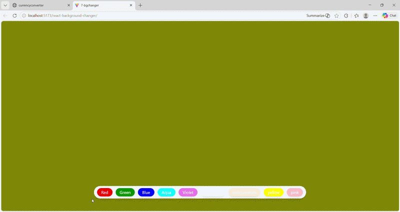
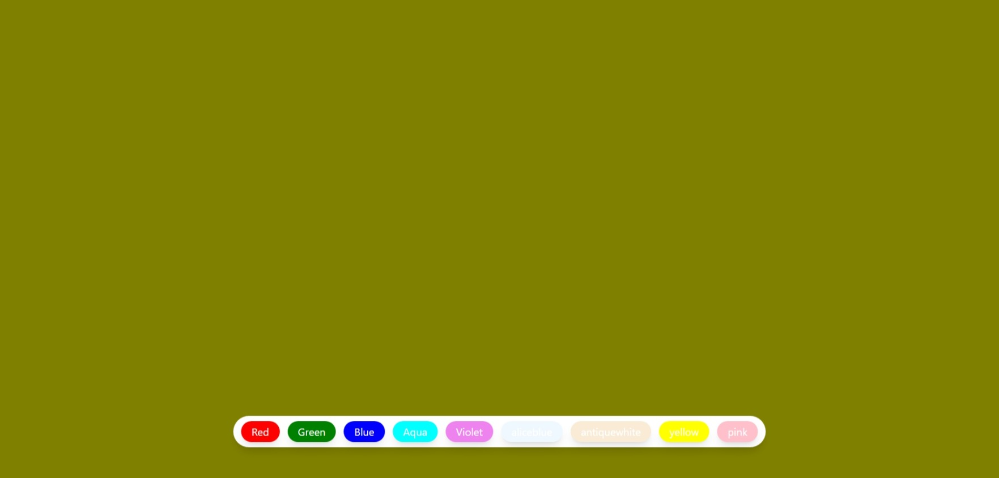
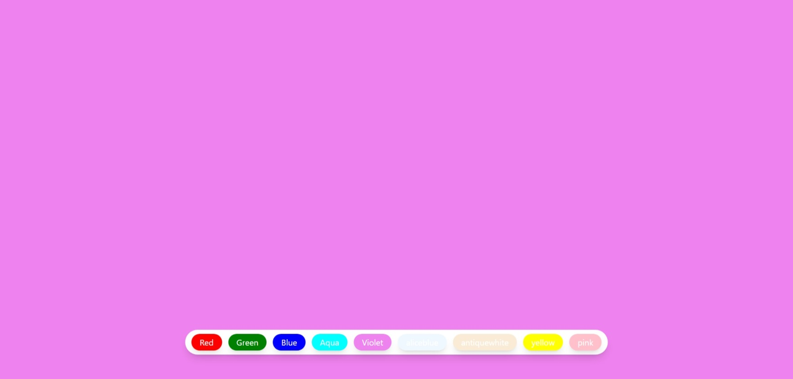
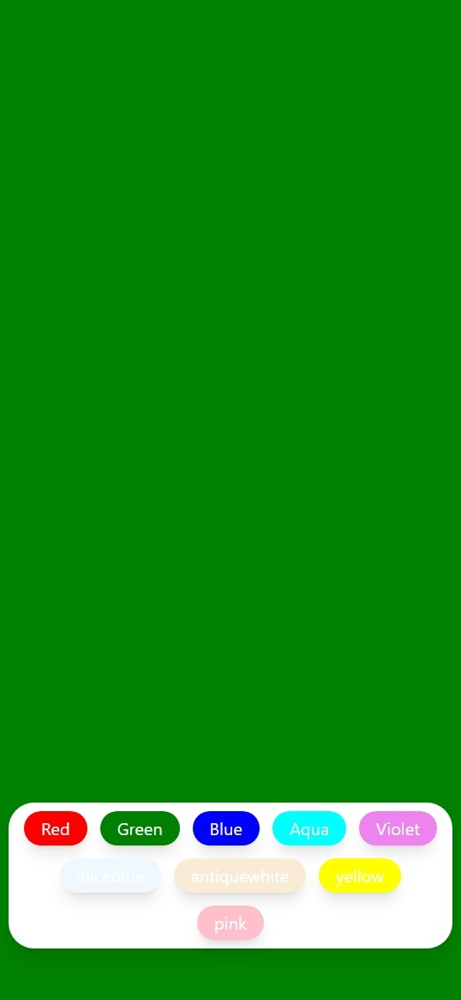

# 🎨 React Background Color Changer


A simple yet interactive **Background Color Changer Web Application** built using **React**, allowing users to dynamically change the background color with a clean and responsive UI.

---

## 🚀 Live Demo

🌐 **Live App:** https://khushi-66.github.io/react-background-changer/

📂 **GitHub Repository:** https://github.com/khushi-66/react-background-changer

---

## 🎥 Live Preview



---

## 📌 Overview

This project demonstrates fundamental concepts of **React state management** and **event handling** through a simple and interactive UI.

It focuses on:

* Dynamic UI updates using React state
* Handling user interactions efficiently
* Creating responsive and minimal UI design

---

## 🧠 Key Learnings

* Managing state using `useState`
* Handling click events in React
* Updating UI dynamically based on user input
* Building reusable and simple components
* Writing clean and maintainable React code

---

## 📸 Screenshots

### 🎨 Color Selection Interface



### 🌈 Background Change Effect



### 📱 Mobile View



---

## ✨ Features

* 🎨 Change background color dynamically
* ⚡ Instant UI updates
* 🎯 Simple and intuitive interface
* 📱 Fully responsive design
* 🧩 Lightweight and fast

---

## ⚡ Performance & Optimization

* Minimal component structure for fast rendering
* Efficient state updates using `useState`
* Instant UI response with no lag
* Lightweight application size

---

## 🛠️ Tech Stack

| Technology            | Usage      |
| --------------------- | ---------- |
| **React.js**          | Frontend   |
| **JavaScript (ES6+)** | Logic      |
| **CSS**               | Styling    |
| **Vite**              | Build tool |

---

## 🌐 Deployment

This project is deployed using **GitHub Pages**, making it accessible globally.

### 🚀 Deployment Process:

* Built the React app for production
* Configured deployment using GitHub Pages
* Hosted directly from the repository
* Generated a live URL for public access

---

## 📂 Project Structure

```bash id="y6y3p3"
react-background-changer/
│── public/
│── src/
│   ├── components/
│   ├── App.jsx
│   └── main.jsx
│── screenshots/
│── assets/
│── package.json
│── README.md
```

---

## ⚙️ Installation & Setup

```bash id="r0o2t3"
git clone https://github.com/khushi-66/react-background-changer.git
cd react-background-changer
npm install
npm run dev
```

---

## 📈 Future Improvements

* 🎨 Add custom color picker
* 🌈 Gradient background support
* 💾 Save selected color (LocalStorage)
* 🌙 Dark/Light theme toggle
* 🎯 Add color palette suggestions

---

## 👩‍💻 Author

**Khushi Sahu**
🔗 https://github.com/khushi-66

---

## ⭐ Support

If you like this project, give it a ⭐ on GitHub!
